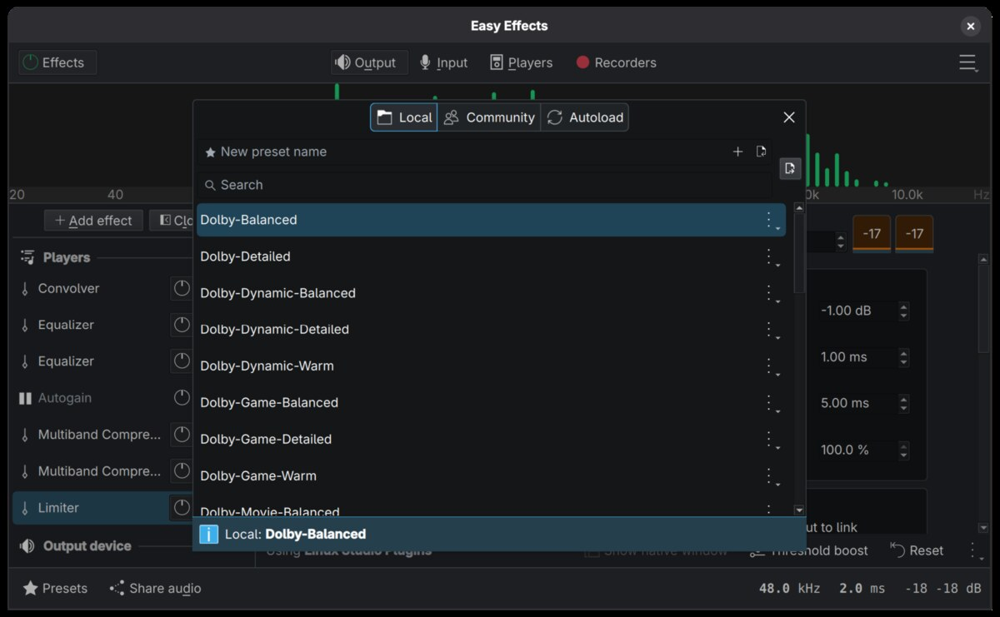
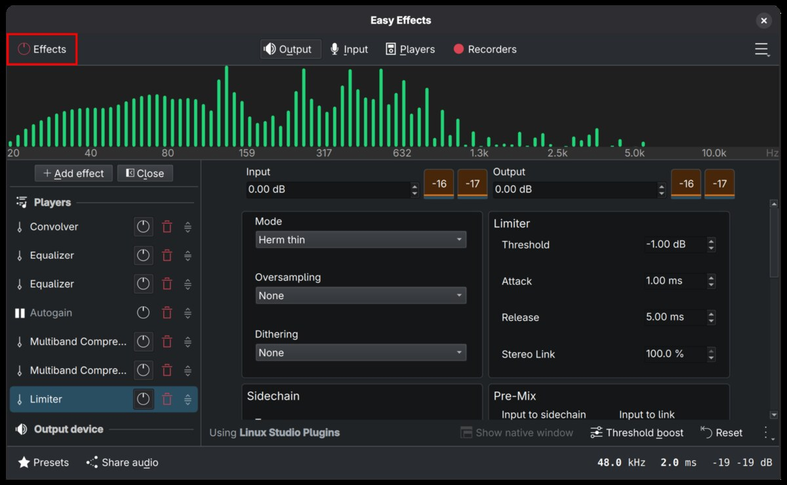
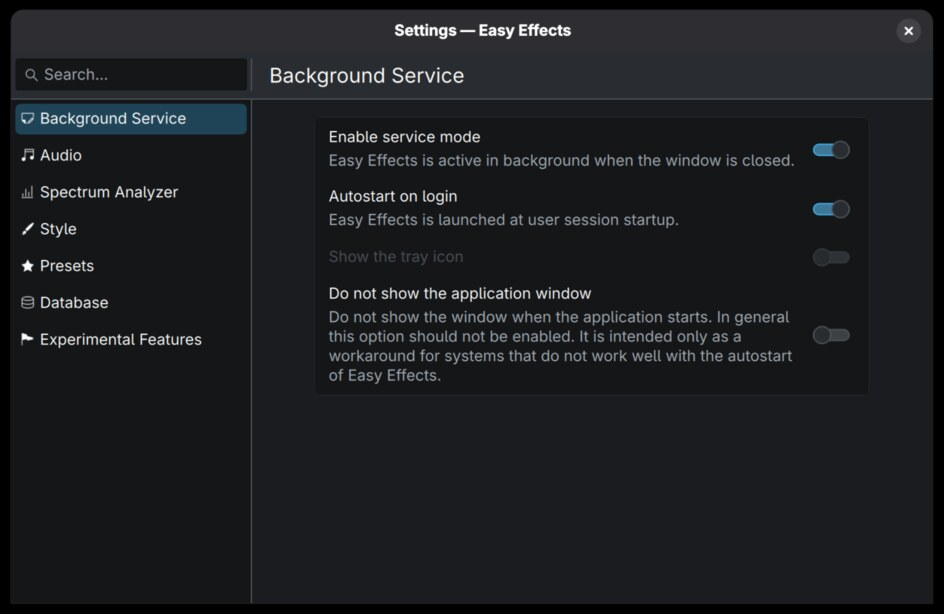
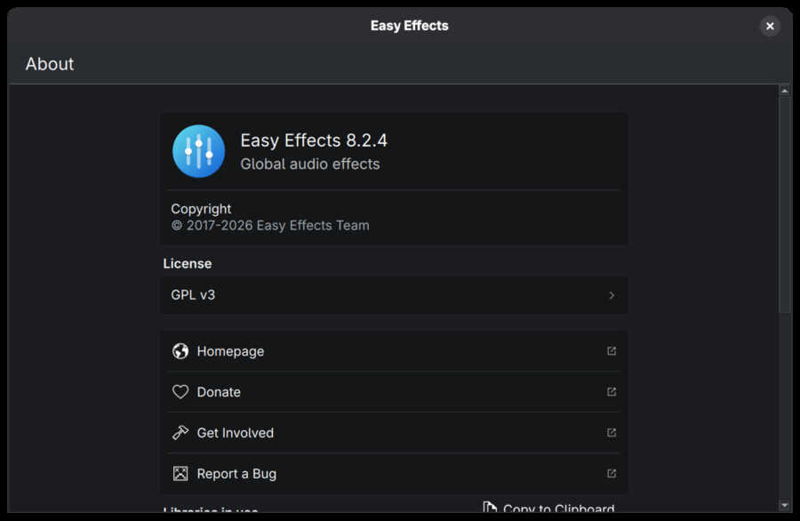
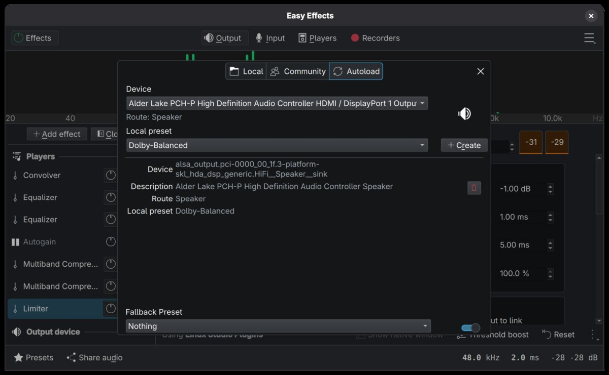
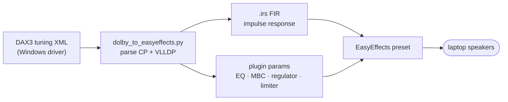
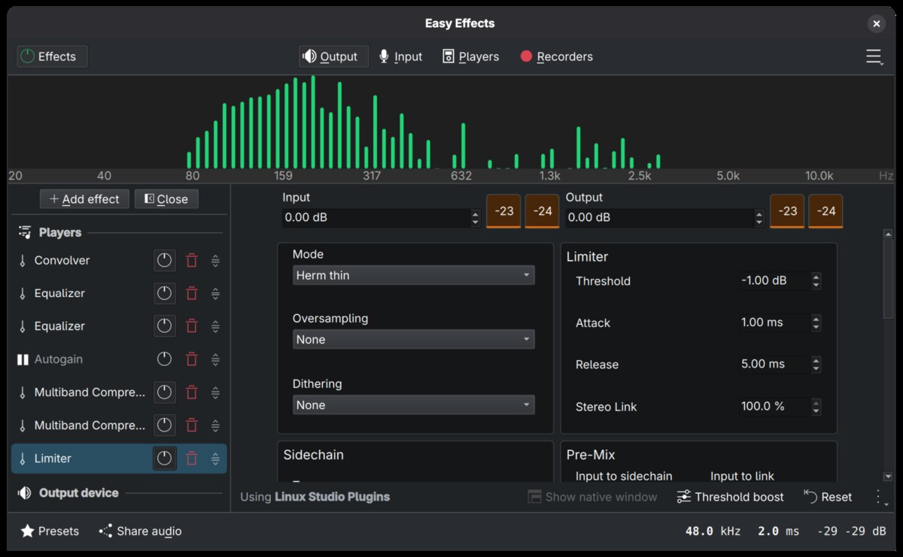

# Dolby Atmos Speaker Tuning to EasyEffects Presets for Linux

Bring your laptop's Windows speaker tuning to Linux. This script converts the
Dolby Atmos DAX3 tuning XML shipped inside Windows audio drivers into
[EasyEffects](https://github.com/wwmm/easyeffects) 8.x output presets — the
same speaker correction, EQ, and dynamics processing your speakers get there,
applied at zero added latency.

> **EasyEffects 8.x required.** If your distro still ships EasyEffects 7
> (Debian trixie, Ubuntu 24.04+, Fedora 43 and earlier), install the
> [Flatpak](https://flathub.org/apps/com.github.wwmm.easyeffects) — the EE 7
> and EE 8 preset formats aren't compatible.

Don't want to run EasyEffects? The same tuning also runs as a self-contained
PipeWire filter-chain — no GUI, no extra daemon. See
[PipeWire filter-chain](#pipewire-filter-chain-instead-of-easyeffects) under
Advanced.

**Contents:** [Quick start](#quick-start) · [Staying up to date](#staying-up-to-date) · [Supported devices](#supported-devices) · [Install](#install) · [Usage](#usage) · [Advanced](#advanced) · [How it works](#how-it-works) · [Running the tests](#running-the-tests) · [Further reading](#further-reading)

## Quick start

1. Install dependencies (see [Install](#install) for your distro). TL;DR: Python 3 with NumPy and SciPy.

2. Run the script. If your Windows partition is mounted or a driver package is extracted in the current directory, no arguments are needed:

   ```bash
   python3 dolby_to_easyeffects.py --autoload
   ```

   Or point it at the Windows directory or a tuning XML explicitly:

   ```bash
   python3 dolby_to_easyeffects.py --windows /mnt/windows/Windows --autoload
   python3 dolby_to_easyeffects.py path/to/DEV_0287_SUBSYS_*.xml --autoload
   ```

The `--autoload` option wires EasyEffects to apply the Dolby correction on your internal speaker automatically. Skip it if you'd rather select a preset yourself (Presets → Dolby-Balanced / Dolby-Detailed / Dolby-Warm); see [Autoload](#autoload) for details.



## Staying up to date

Notable changes are tracked in [CHANGELOG.md](CHANGELOG.md), and each version is published as a [GitHub Release](https://github.com/antoinecellerier/speaker-tuning-to-easyeffects/releases). To be notified when a new version ships, click **Watch → Custom → Releases** at the top of the GitHub page.

Entries tagged **[AUDIBLE]** change the *sound* of the generated preset — when you see one, pull the latest and **re-run the script to regenerate your preset** (then reload it in EasyEffects, or restart PipeWire if you use the filter-chain conf) to pick up the improvement. Other entries are tooling, packaging, docs, or new-device support that doesn't alter existing devices' output, so there's nothing to regenerate.

Each generated preset and `.conf` is stamped with the version that produced it (a `_generator` field in the preset JSON, a `# version:` line in the conf; `--version` prints it), so you can always tell what made a given file when reporting an issue.

## Supported devices

The converter works on laptop internal speakers whose Windows driver ships a Dolby DAX3 tuning — Realtek and Qualcomm Aqstic HD-Audio codecs and newer SoundWire smart-amp platforms. Confirmed on:

| Device | Codec / Subsystem | Reported by |
|---|---|---|
| ASUS TUF Gaming A15 (FA507NV) | Realtek ALC256, 1043:19DD | [#34](https://github.com/antoinecellerier/speaker-tuning-to-easyeffects/issues/34) |
| ASUS Zenbook 14 UX3405CA, UX3405MA | Realtek ALC294, 1043:1A63 | [#19](https://github.com/antoinecellerier/speaker-tuning-to-easyeffects/issues/19), [#24](https://github.com/antoinecellerier/speaker-tuning-to-easyeffects/issues/24) |
| Lenovo IdeaPad Pro 5 14AHP9 (83D3) | Realtek ALC287, 17AA:38D0 | [#18](https://github.com/antoinecellerier/speaker-tuning-to-easyeffects/issues/18) |
| Lenovo IdeaPad Pro 5 14APH8 (83AM) | Realtek ALC287, 17AA:38C5 | [#33](https://github.com/antoinecellerier/speaker-tuning-to-easyeffects/issues/33) — reporter confirms working on kernel 7.0, broken on 6.12 |
| Lenovo IdeaPad Pro 5 14IMH9 (83D2) | Realtek ALC287, 17AA:38CE | [#36](https://github.com/antoinecellerier/speaker-tuning-to-easyeffects/issues/36) — reporter recommends enabling autogain |
| Lenovo Yoga 7 2-in-1 16AKP10 | — | [#1](https://github.com/antoinecellerier/speaker-tuning-to-easyeffects/issues/1) |
| Lenovo Yoga Pro 7 14APH8 (82Y8) | Realtek ALC287, 17AA:38C6 | [#30](https://github.com/antoinecellerier/speaker-tuning-to-easyeffects/issues/30) |
| Lenovo Yoga Pro 9 14IRP8 (83BU) | Realtek ALC287, 17AA:38BE | [#17](https://github.com/antoinecellerier/speaker-tuning-to-easyeffects/issues/17) |
| ThinkPad E14 Gen 2 AMD (20T6) | Realtek ALC257, 17AA:507F | [#25](https://github.com/antoinecellerier/speaker-tuning-to-easyeffects/issues/25) — verified close-to-Windows: needs `--enable autogain`, plus to taste a raised Autogain *Target* (EE GUI) and desktop volume >100% |
| ThinkPad T14 Gen 7 (21WNCTO1WW) | Realtek ALC257, 17AA:2356 | [#42](https://github.com/antoinecellerier/speaker-tuning-to-easyeffects/issues/42) |
| ThinkPad T14s Gen 6 AMD | 17AA:50F0 | [#3](https://github.com/antoinecellerier/speaker-tuning-to-easyeffects/issues/3) |
| ThinkPad X1 Carbon Gen 13 | Soundwire 17AA:2339 | [PR7](https://github.com/antoinecellerier/speaker-tuning-to-easyeffects/pull/7/) |
| ThinkPad X1 Yoga Gen 7 | Realtek ALC287, 17AA:22E6 | author |
| ThinkPad X13 Gen 6 Intel (21RK) | Realtek ALC257, 17AA:2344 | [#23](https://github.com/antoinecellerier/speaker-tuning-to-easyeffects/issues/23) |

If you test it on other hardware, please [open a device report](https://github.com/antoinecellerier/speaker-tuning-to-easyeffects/issues/new?template=device-report.yml) whether it works or not — run `python3 dolby_to_easyeffects.py --speaker-info` and paste the output.

## Install

The script needs Python 3, [NumPy](https://numpy.org/), and [SciPy](https://scipy.org/). PipeWire's `pw-dump` is also required if you use `--autoload`, but it's already installed on any distro running EasyEffects. [Rich](https://github.com/Textualize/rich) and [rich-argparse](https://github.com/hamdanal/rich-argparse) are optional — with them the script renders its output and `--help` with semantic colors; without them everything still works in plain monochrome.

<details>
<summary>Install commands for your distro</summary>

- **Debian / Ubuntu / Mint / Pop!_OS:** `sudo apt install python3-numpy python3-scipy python3-rich python3-rich-argparse`
- **Fedora / RHEL / Rocky / Alma:** `sudo dnf install python3-numpy python3-scipy python3-rich python3-rich-argparse`
- **openSUSE (Leap / Tumbleweed):** `sudo zypper install python3-numpy python3-scipy python3-rich python3-rich-argparse`
- **Arch / Manjaro / EndeavourOS:** `sudo pacman -S python-numpy python-scipy python-rich python-rich-argparse`
- **Alpine:** `sudo apk add py3-numpy py3-scipy py3-rich py3-rich-argparse`
- **Gentoo:** `sudo emerge dev-python/numpy dev-python/scipy dev-python/rich dev-python/rich-argparse`
- **NixOS (shell):** `nix-shell -p "python3.withPackages (ps: with ps; [ numpy scipy rich rich-argparse ])"`

</details>

If your distro isn't listed or you'd rather not touch system packages, a venv works too:

```bash
python3 -m venv .venv && source .venv/bin/activate
pip install -r requirements.txt
```

`requirements.txt` also pulls in `pytest` so you can run the test suite (`pytest tests/`) from the same venv.

## Usage

### Command-line options

- `--windows DIR` — auto-discover tuning XML from a mounted Windows directory. Omit both this flag and a positional XML path to let the script probe `/proc/mounts` and the current directory automatically
- `--best-guess` — if auto-detection finds no exact hardware match, fall back to the only internal-speaker tuning whose manufacturer is present (or list the candidates to pick one with the positional XML path); reach for it when a SoundWire laptop reports "No matching DAX3 tuning XML found"
- `--list` — show available endpoints and profiles in the XML, then exit
- `--speaker-info` — report detected audio hardware and speaker layout, then exit
- `--doctor` (alias `--diagnose`) — run environment self-diagnostics (EasyEffects version/compatibility, install location, preset + impulse-file integrity, the selected preset, background-service setup (service mode + autostart), and hardware) and exit. If a generated preset seems inaudible, run this first and paste the output into an issue. See [Troubleshooting](#troubleshooting-a-preset-that-sounds-like-nothing) below
- `--endpoint TYPE` — endpoint type (default: `internal_speaker`)
- `--mode MODE` — endpoint operating mode (default: `normal`). Convertible laptops (Yoga-class) ship distinct tunings per hinge pose — try `--mode tablet`, `stand`, `tent`, or `lid_close` if `--list` shows them for your device.
- `--profile TYPE` — profile type, e.g. `dynamic`, `music`, `voice` (default: first profile)
- `--all-profiles` — generate presets for all profiles in the selected endpoint/mode (9 profiles × 3 IEQ curves = 27 presets)
- `--autoload [PRESET]` — write EasyEffects autoload config for speaker outputs; defaults to the first Balanced preset generated
- `--autoload-dir DIR` — autoload config directory (default: `~/.local/share/easyeffects/autoload/output/`)
- `--autoload-sink NODE_NAME` — bind autoload to an explicit PipeWire sink, bypassing speaker detection (repeatable). Use it if detection picks the wrong output or finds none (e.g. a laptop whose speaker isn't tagged `audio-speakers`). Find the name with `pw-dump | grep node.name`. See [Autoload](#autoload) below.
- `--no-autoload-bypass` — with `--autoload`, don't write a `Nothing` bypass preset or enable EasyEffects' global Fallback Preset. See [Autoload](#autoload) below.
- `--prefix NAME` — change preset name prefix (default: `Dolby` → `Dolby-Balanced`, etc.)
- `--output-dir DIR` — EasyEffects preset directory (default: `~/.local/share/easyeffects/output/`)
- `--irs-dir DIR` — impulse response directory (default: `~/.local/share/easyeffects/irs/`)
- `--disable NAME` — drop a filter from the generated preset (repeatable). Valid names: `volmax`, `mbc`, `regulator`, `bass-enhancer`, `dialog`, `high-shelf`, `lo-pass`. See [Disabling filters](#disabling-filters) below.
- `--volmax-slot {input-gain,output-gain}` — where the `volmax-boost` loudness gain is injected. Default `input-gain` runs it through the per-band regulator so loud bass doesn't distort (issue #23); `output-gain` is the older placement (opt-out for A/B or to recover loudness). See [Disabling filters](#disabling-filters).
- `--enable NAME` — activate a filter that ships present but inactive (repeatable, mirroring `--disable`). Valid names: `autogain` — the volume leveler; recovers most of the loudness gap vs Windows on HDA devices, at some saturation risk on quiet-background content. See [Troubleshooting: correct but too quiet](#troubleshooting-correct-but-too-quiet).
- `--dry-run` — run without writing any files to disk (presets, IRs, autoload); useful for debugging script execution and output
- `--no-color` — disable colored terminal output

When `--mode` or `--profile` is specified (or `--all-profiles` is used), the preset names include them (e.g. `Dolby-Music-Balanced`, `Dolby-Tablet-Voice-Warm`).

### Troubleshooting: a preset that sounds like nothing

If you generated a preset, loaded it, and hear no difference versus bypass, the preset itself is usually fine — the cause is almost always something in the EasyEffects setup around it. Run:

```
python3 dolby_to_easyeffects.py --doctor
```

It checks the common causes and prints a pasteable report:

- **EasyEffects 7** — version 8 changed the preset format, so on EasyEffects 7 the speaker-correction filter loads nothing and the preset is effectively bypassed. This repo targets EasyEffects 8.x (see the note at the top — install the [Flatpak](https://flathub.org/apps/com.github.wwmm.easyeffects) if your distro still ships 7).
- **Wrong install location** — presets written to the Flatpak path while you run the native package (or vice-versa), so EasyEffects never sees them.
- **A missing impulse file** — the convolver references a `.irs` that isn't in the irs directory, so the speaker correction is silent.
- **No Dolby preset selected**, or EasyEffects' global bypass is on — the highlighted top-left toggle below.
- **EasyEffects not running in the background** — the preset only processes audio while EasyEffects is active, so it can vanish after you close the window or reboot. In EasyEffects → Preferences → Background Service (below), enable *Enable service mode* and *Autostart on login*. `--doctor` reports whether both are set.





A normal generation run also warns at the end if it detects an EasyEffects version that can't use the presets it just wrote. To check your version directly, see EasyEffects' About dialog:



### Troubleshooting: correct but too quiet

If the preset sounds right but quieter than Windows, part of the gap is expected: Dolby's dynamic volume leveler ships bypassed here because without Dolby's content analysis it distorts on quiet→loud transitions ([why](docs/design-notes.md#why-autogain-is-bypassed-by-default)). What to try, in order:

- **Re-run the script with `--enable autogain`** — the volume leveler ships bypassed by default and carries most of the loudness gap (~+9 dB measured on program material). The trade-off: without Dolby's content analysis it can audibly saturate when loud sound arrives over a quiet background (why it isn't the default); if you hear that, drop the flag again. For still more loudness raise the Autogain *Target* a few dB in the EasyEffects GUI, at increased saturation risk. If you instead enable Autogain by hand on a preset generated before this option existed, also raise its *Silence threshold* to about −50 dB, or sounds arriving after silence will crackle.
- **Allow volume above 100%** in your desktop environment: GNOME — `gsettings set org.gnome.desktop.sound allow-volume-above-100-percent true`; KDE Plasma — volume applet settings → *Raise maximum volume*; any environment — `wpctl set-volume @DEFAULT_AUDIO_SINK@ 1.25`, or pavucontrol. Over-amplification is digital gain applied after the preset's limiter, so extreme values can clip.
- **Check mixer levels** — in `alsamixer`, Master/PCM/Speaker at 100%.
- On a device whose regulator is aggressive, `--volmax-slot output-gain` can recover some loudness — see [Disabling filters](#disabling-filters).
- **Speakers thin and quiet even with EasyEffects off** — run `--speaker-info`: a flagged amplifier-firmware error means your distro lacks this machine's speaker firmware, which no preset can fix ([background](docs/cross-device-findings.md); [issue #27](https://github.com/antoinecellerier/speaker-tuning-to-easyeffects/issues/27) links a worked, device-specific example of extracting it from the Windows driver).

### Disabling filters

If the generated preset has audible artifacts on your hardware (saturation, pumping, harsh highs, uncomfortable stereo width), you can rebuild it without specific filters rather than hand-editing the chain inside EasyEffects. Repeat `--disable NAME` as many times as needed:

| Name | What to try if you hear... |
|------|----------------------------|
| `volmax` | Output too loud / the final limiter pumping on loud masters. Drops the static `volmax-boost` loudness gain (~+6 dB). *Distortion on loud **low** frequencies is already handled by the default `--volmax-slot input-gain`; if that costs loudness, try `--volmax-slot output-gain`.* |
| `mbc` | A compressed or "squashed" character you don't like. Drops the multi-band dynamics processor (1–4 bands depending on profile). |
| `regulator` | Unusual spectral pumping or narrow-band breathing. Drops the per-band limiter; `volmax` (if enabled) falls back to the brickwall limiter's input-gain. |
| `bass-enhancer` | Bass sounds artificial or distorted on SoundWire devices. Only emitted for SoundWire speakers. |
| `dialog` | Vocals feel over-boosted or harsh in the presence region. Drops the 2.5 kHz speech-band EQ. |
| `high-shelf` | Harsh or sibilant high frequencies on devices whose tuning includes a type-3 shelf (Lenovo AIO-RTK XMLs around 2.7 kHz, +2–5 dB). **Experimental** path — reproduction of the Dolby tuning is numerically verified, but has not yet been audibly validated. Feedback welcome. |
| `lo-pass` | Highs sound rolled off or dull on devices whose tuning includes a type-6/8 low-pass (rare; a few ALC274 SKUs). **Experimental**, same caveat as `high-shelf`. |

Convolver, PEQ, autogain, and the final brickwall limiter can't be disabled from the CLI — they're the FIR correction, speaker PEQ, volume-leveler placeholder, and safety net respectively.

## Advanced

### Autoload

`--autoload` configures EasyEffects to apply a preset automatically whenever the internal speaker output becomes active. Generate all presets and autoload one on the speaker:

```bash
python3 dolby_to_easyeffects.py --windows /mnt/windows/Windows \
    --all-profiles --autoload Dolby-Dynamic-Balanced
```

It writes a `{node.name}:{route}.json` autoload file to `~/.local/share/easyeffects/autoload/output/`, detects the speaker sink via `pw-dump`, and also installs an empty `Nothing` bypass preset so non-speaker outputs (HDMI, Bluetooth, USB) don't keep processing the speaker tuning. Run it from a desktop session with PipeWire running; restart EasyEffects afterward if it was already running. For the autoload to take effect on every login, also enable Background Service + Autostart on login in EasyEffects' preferences (see [Troubleshooting](#troubleshooting-a-preset-that-sounds-like-nothing)) so EasyEffects is actually running when the speaker becomes active. Pass `--autoload-sink NODE_NAME` to bind a sink yourself, or `--no-autoload-bypass` to skip the bypass.



<details>
<summary>How speaker detection and the bypass fallback work</summary>

The autoload file follows EasyEffects' convention (`{node.name}:{route}.json`, where `{route}` is the sink's active output route description — e.g. `Speaker` — which is what EasyEffects matches on, not the card profile). Speaker sinks are detected from PipeWire via `pw-dump`: first the sinks tagged with the `audio-speakers` device icon (excluding HDMI/DisplayPort/Bluetooth). If none are tagged — some laptops lack a device-specific UCM2 profile and fall back to a generic one that doesn't set the speaker icon — the script falls back to a relaxed tier of internal analog outputs (still excluding HDMI/Bluetooth/headsets), auto-applying a single match, prompting you to choose when several are found, and listing every sink it saw (with its icon) so you can see why. If the active output route can't be read from PipeWire, that sink is skipped (with an explanation) rather than written with a guessed name EasyEffects wouldn't match.

EasyEffects applies the last-loaded preset to whatever sink is currently active, so switching to HDMI, a USB headset, or Bluetooth while a Dolby preset is loaded keeps processing the Dolby correction on hardware it was never tuned for. `--autoload` mitigates this by also writing the `Nothing` bypass preset and turning on EasyEffects' global Fallback Preset (pointing it at `Nothing`) — any sink without its own autoload entry then falls back to a no-op chain. If EasyEffects is running when the script writes, you'll need to restart it for the setting to take effect. An existing `Nothing.json` preset is preserved, and an already-enabled fallback (pointing at any preset) is left untouched. Pass `--no-autoload-bypass` to skip both steps if you manage this yourself.

</details>

### PipeWire filter-chain instead of EasyEffects

`ee_to_pipewire.py` converts a generated EasyEffects preset into a self-contained PipeWire filter-chain `.conf` — the same tuning, no GUI, lower CPU, set-and-forget. It works whether or not EasyEffects is installed. Design notes and equivalence measurements: [`docs/ee-to-pipewire.md`](docs/ee-to-pipewire.md).

#### Quick start (PipeWire)

Step 1 is the same generator the EasyEffects flow uses, so its prerequisites carry over: install the Python dependencies (NumPy/SciPy — see [Install](#install)), and locate your tuning XML the same way (auto-discovery, `--windows`, or [manual extraction](#extracting-the-xml); the main [Quick start](#quick-start) and [Usage](#usage) cover the options and which presets get generated). You just skip `--autoload`, which only wires EasyEffects. `ee_to_pipewire.py` itself adds no Python dependencies; its only runtime needs are the LSP/Calf LV2 plugins (see *Plugin dependencies and validation* below).

```bash
# 1. Generate the preset JSON (no EasyEffects install required)
python3 dolby_to_easyeffects.py            # omit --autoload; that only wires EE

# 2. Convert it to a filter-chain conf (the matching .irs is copied beside it)
python3 ee_to_pipewire.py ~/.local/share/easyeffects/output/Dolby-Balanced.json

# 3. Activate
systemctl --user restart pipewire pipewire-pulse

# 4. Confirm the sink is loaded
pw-cli ls Node | grep Dolby_Balanced
```

The conf lands in `~/.config/pipewire/pipewire.conf.d/` and attaches transparently to your internal-speaker sink — apps keep targeting the speaker, while HDMI / Bluetooth / USB outputs bypass it automatically. Stereo only. It covers the convolver, PEQ, dialog, multiband compressor, regulator and limiter, plus `bass_enhancer` / `stereo_tools`; an active volume leveler (`autogain`) is translated too, and only 4-channel upmix isn't (see [Limitations](docs/ee-to-pipewire.md#limitations--known-gaps)).

- **Already run EasyEffects?** Quit it — or remove its autoload for this device — before activating, or both chains process the audio at once.
- **To remove the filter:** delete `~/.config/pipewire/pipewire.conf.d/Dolby_Balanced.conf` (and the `.irs` beside it), then restart pipewire.

<details>
<summary>Plugin dependencies and validation</summary>

The chain loads LV2 plugins from your system: **LSP** (`lsp-plugins-lv2` on Debian/Ubuntu, `lsp-plugins` on Fedora/Arch) for the PEQ / MBC / regulator / limiter, and **Calf** (`calf-plugins`) for the `bass_enhancer` / `stereo_tools` stages when the preset uses them. Both are typical EasyEffects dependencies, so they're already present if you've used EE — but if they're missing the chain won't load in PipeWire.

Before writing the conf the converter runs `lv2info` (`lilv-utils`) to validate it against installed plugin metadata; that pass also surfaces a **missing plugin** as a `[validate]` warning. If `lv2info` itself isn't installed the converter can't run that check — it prints a reminder to install the plugins instead. Pass `--no-validate` to skip the check entirely.

</details>

<details>
<summary><code>ee_to_pipewire.py</code> command-line options</summary>

- `preset` (positional) — path to the EasyEffects preset JSON (the output of `dolby_to_easyeffects.py`, e.g. `~/.local/share/easyeffects/output/Dolby-Balanced.json`)
- `--target-sink NODE_NAME` — hardware sink the filter attaches to as a WirePlumber smart filter (default: auto-detect the internal-speaker sink, the same probe `--autoload` uses). Pass an empty string (`''`) to disable smart-filter routing and emit a v1 virtual sink that apps target directly
- `--output PATH` — output `.conf` path (default: `~/.config/pipewire/pipewire.conf.d/<node-name>.conf`)
- `--irs-dir DIR` — directory holding the `.irs` referenced by the preset's convolver (default: `~/.local/share/easyeffects/irs`)
- `--node-name NAME` / `--node-description DESC` — override the sink's node name / human-readable label (default: derived from the preset filename stem, so converting several presets yields distinct sinks)
- `--no-copy-irs` — leave the conf pointing at the original EE-side `.irs` instead of copying it beside the conf (lets EE preset regenerations propagate, at the cost of a cross-tree dependency)
- `--no-validate` — skip the `lv2info` schema self-check (e.g. on systems without `lv2info` installed)
- `--no-color` — disable colored terminal output (output is already plain when `rich` isn't installed)
- `--force` — overwrite the output conf if it already exists
- `--dry-run` — print the generated conf to stdout instead of writing it
- `--version` — print the version (`git describe`) and exit

</details>

#### Which should I use?

The two paths sound the same ([measured equivalent](docs/ee-to-pipewire.md#equivalence-to-the-ee-chain)) — choose on everything else:

- **Features → EasyEffects.** A GUI to tweak and switch presets live. The volume-leveler / `autogain` (EE-native libebur128) is now translated on the PW side too, to LSP `autogain_stereo` (a K-weighted LUFS AGC) — so it's no longer an EE-only stage. It runs by default on SoundWire devices; on HDA the generator leaves autogain bypassed unless you pass `--enable autogain`, because its loudness boost can audibly saturate on quiet-background content ([why](docs/design-notes.md#why-autogain-is-bypassed-by-default)).
- **Lightness / headless / set-and-forget → the PW conf.** No GUI, no extra daemon. On the development device (X1 Yoga, `Dolby-Balanced`, 48 kHz) the filter-chain costs **~11 % fewer CPU cycles** and **~3.5× less RAM** (~78 MB vs ~270 MB — the EasyEffects process is mostly Qt/GUI) than running EasyEffects. Both are light in absolute terms — the DSP is roughly a tenth of one CPU core (well under 1 % of a typical multi-core laptop) — so the memory and feature differences usually matter more than the CPU one.
- **Latency → a wash.** Both add zero latency over the PipeWire quantum (minimum-phase FIR), and both ran xrun-free at 1024/48 kHz.

Those CPU/RAM figures are device-specific; reproduce them on your own hardware with [`tools/measure_perf/`](tools/measure_perf/) (frequency-invariant `perf`-cycle measurement, since laptop clocks don't hold still).

### Extracting the XML

The easiest way is to use `--windows` to auto-discover the XML from a mounted Windows partition. The script reads your audio codec's device and subsystem IDs from `/proc/asound` and matches them against the XMLs in the DriverStore.

<details>
<summary>Manual extraction, or from a Lenovo driver EXE (no Windows partition)</summary>

If you prefer to extract the XML manually, it can be found in the Windows driver package at:
```
C:\Windows\System32\DriverStore\FileRepository\dax3_ext_*.inf_*\DEV_*_SUBSYS_*.xml
```
Match **both** the `DEV_` portion of the filename to your codec's device id (the last four hex digits of `Vendor Id`, e.g. `0x10ec0287` → `DEV_0287`) **and** the `SUBSYS_` portion to its subsystem ID (both visible via `cat /proc/asound/card*/codec* | grep -E 'Vendor|Subsystem'`). The subsystem alone is not enough — Lenovo reuses subsystem IDs across different codecs, and picking the other codec's tuning sounds clearly wrong ([details](docs/cross-device-findings.md)). The `_settings.xml` companion file contains UI/profile defaults and is not needed.

**From a Lenovo driver EXE.** Download the Lenovo audio driver EXE (e.g. `n4ba126w.exe`) into this project directory. You need [`innoextract`](https://constexpr.org/innoextract/install) installed. From the project root, run:

```bash
# 1. Extract only the Dolby tuning XMLs into ./driver-cache/
innoextract -I 'code$GetExtractPath$/Dolby/03_dax_ext' -d ./driver-cache ./n4ba126w.exe

# 2. Generate presets (autoprobe finds the extracted XMLs automatically)
python3 dolby_to_easyeffects.py --autoload
```

If the autoprobe reports ambiguity (e.g. you have several extracted driver trees), pass `--windows ./driver-cache` to point it at the one you want.

</details>

### Auto-detection notes

<details>
<summary>How the script finds your XML, EasyEffects install, and codec</summary>

**Windows partition or extracted DriverStore.** Omitting `--windows` and the positional XML triggers the autoprobe. It enumerates NTFS-family mountpoints (`ntfs`, `ntfs3`, `fuseblk`) from `/proc/mounts` and keeps any whose DriverStore contains `dax3_ext_*.inf_*` subdirs — both full system roots like `/mnt/windows/Windows` and drive-root mounts like `/mnt/c` are accepted. If nothing mounted matches, it falls back to a bounded walk of the current directory for any directory whose files include a Dolby-shaped XML (`DEV_*_SUBSYS_*.xml` / `SOUNDWIRE_*_SUBSYS_*.xml` / `SDW_*_SUBSYS_*.xml`, excluding `_settings.xml` companions). That covers the raw `innoextract` layout (`./driver-cache/code$GetExtractPath$/Dolby/03_dax_ext/`) as well as hand-organised collections — no `dax3_ext_*.inf_*` rename required. The walk skips hidden directories, doesn't follow symlinks, and is depth-capped. A single unambiguous match is used; when several match, the autoprobe narrows to those containing an XML for your detected audio hardware and uses it if exactly one survives, otherwise erroring with the shortlist so you can pick one via `--windows DIR`.

**Flatpak EasyEffects.** The script auto-detects whether EasyEffects is installed via Flatpak or as a native package. If `~/.var/app/com.github.wwmm.easyeffects/config/easyeffects/` exists, it writes presets there; otherwise it falls back to the native `~/.local/share/easyeffects/` path. You can still override with `--output-dir`, `--irs-dir`, and `--autoload-dir`.

**SoundWire codecs (newer Intel platforms).** Auto-detection also handles SoundWire-based audio (Lunar Lake / Panther Lake and later, Meteor Lake, some Tiger/Alder Lake SKUs), including Qualcomm Aqstic and Cirrus cs35l56 smart-amp platforms. The script reads device IDs from `/sys/bus/soundwire/devices/` and the PCI subsystem ID of the HD Audio controller from `/sys/class/sound/card*/device`, and matches them against Dolby filenames of the form `SOUNDWIRE_MAN_<man>_FUNC_<func>_SUBSYS_<device><vendor>.xml` (e.g. `SOUNDWIRE_MAN_025D_FUNC_1318_SUBSYS_233917AA.xml`). The PCI subsystem is the per-device key — on Cirrus platforms the `FUNC` token is a device id that needn't equal the Linux SoundWire part id (see [cross-device-findings](docs/cross-device-findings.md)), so if no part matches, the script falls back to the PCI subsystem + manufacturer. `--windows` accepts either a full Windows system root (e.g. `/mnt/windows/Windows`), a drive-root mount (e.g. `/mnt/c` — the script looks for a case-insensitive `Windows/` child), *or* an already-extracted DriverStore directory containing `dax3_ext_*.inf_*` subfolders directly.

</details>

## How it works

The script parses the DAX3 XML's two processing stages and emits a minimum-phase FIR impulse response plus a chain of EasyEffects plugins — every parameter traced back to an XML field, at zero added latency.



The preset is up to eight plugins in order: **Convolver** (FIR speaker correction) → **Bass Enhancer** (SoundWire only) → **Equalizer** (speaker PEQ) → **Dialog Enhancer** → **Autogain** (bypassed by default) → **Multiband Compressor** → **Regulator** (per-band limiter) → **Limiter** (brickwall safety net).



For the full detail, see the docs:

- **[docs/reference.md](docs/reference.md)** — the current-state reference: every XML→parameter mapping, the plugin chain in detail, units, profile differences, which mappings are DAX-validated, and what's deliberately not implemented (and why).
- **[docs/design-notes.md](docs/design-notes.md)** — the research log: why the chain is ordered this way, the FIR cepstral construction, what was attempted and rejected, and the open threads worth picking up.
- **[docs/cross-device-findings.md](docs/cross-device-findings.md)** — empirical analysis across ~2,500 DAX3 files: which DSP blocks are universal vs. device-specific.

## Running the tests

A `pytest` suite under `tests/` covers the converter without requiring any proprietary Dolby tuning data as input.

```bash
pytest tests/
```

The bulk of the suite (DSP math, output schema, a dedicated regression suite for every shipped-bug "trap", and `--disable`/argparse behavior) runs in a couple of seconds and needs no setup. It uses synthetic, hand-built inputs only — no real DAX3 XML is shipped or checked in.

The corpus tier under `tests/corpus/` runs the full pipeline (parse → FIR → preset → IRS) against a corpus of real DAX3 XMLs. It auto-discovers them the same way the main script does — NTFS-family mountpoints whose DriverStore contains `dax3_ext_*.inf_*`, plus a bounded walk of the current working directory for any folder containing Dolby-shaped XMLs. To override, point it at a specific directory:

```bash
ATMOS_CORPUS_DIR=/path/to/dax3/xmls pytest tests/corpus/
```

If no corpus is reachable and `ATMOS_CORPUS_DIR` is unset, the corpus tier skips cleanly.

The heaviest tier validates every discovered XML's generated PipeWire conf through `lv2info`; it is gated behind `--run-slow` (or `ATMOS_RUN_SLOW=1`). On a multi-core machine, install the optional [`pytest-xdist`](https://pypi.org/project/pytest-xdist/) (included in `requirements.txt`) and pass `-n auto` to fan the cases across cores — `ATMOS_RUN_SLOW=1 pytest tests/corpus/ -n auto` — which turns that tier from minutes into seconds.

The suite catches structural regressions (FIR not minimum-phase, convolver autogain accidentally re-enabled, MBC compression-mode flipped to upward, enums emitted as integers, etc.) but does not substitute for listening tests after any change to the output path.

## Further reading

In-tree docs and tooling with more context:

- [docs/reference.md](docs/reference.md) — current-state reference: XML→parameter mappings, the plugin chain, units, profile differences, and what's not implemented
- [docs/design-notes.md](docs/design-notes.md) — research log: why the plugin chain is ordered the way it is, gain-staging rationale, why autogain is bypassed by default, and an empirical comparison of our generated FIR against DAX3's actual response on Windows
- [docs/cross-device-findings.md](docs/cross-device-findings.md) — empirical analysis of ~2,500 DAX3 tuning files across Realtek, Senary, Qualcomm Aqstic, and SoundWire smart-amp codecs, including which DSP blocks are unmodeled
- [docs/alternative-pipelines.md](docs/alternative-pipelines.md) — design sketches for offloading parts of the pipeline to Intel SOF DSP or running under PipeWire filter-chain instead of EasyEffects
- [docs/ee-to-pipewire.md](docs/ee-to-pipewire.md) — current architecture of the `ee_to_pipewire.py` companion converter: smart-filter routing, self-contained conf layout, plugin coverage, and equivalence guarantees
- [tools/measure_dax/](tools/measure_dax/) — Windows-side capture + Linux-side analysis scripts for measuring DAX3's actual response via WASAPI loopback. Reproduces the empirical comparison in `design-notes.md` on any Lenovo/ThinkPad with DAX3 installed.
- [tools/measure_ee/](tools/measure_ee/) — Linux-side counterpart: captures the live EasyEffects pipeline (with our generated preset applied) into the same `loopback_*.{wav,json}` schema, so `tools/measure_dax/analyze.py` and `tools/measure_ee/compare_ee_vs_dax.py` can overlay the EE-on-Linux response next to the DAX-on-Windows reference.
- [tools/measure_pw/](tools/measure_pw/) — captures and validates the PipeWire filter-chain rendering of the same preset (`ee_to_pipewire.py` companion). A `validate_conf.py` deterministic schema check catches inverted bools / unknown ports / out-of-range values without any audio capture, and `compare_ee_vs_pw.py` / `_time_domain.py` overlay the PW captures against the EE-side captures from `tools/measure_ee/`.
- [tools/measure_perf/](tools/measure_perf/) — measures what the two delivery paths *cost* (where `measure_pw` proves they *sound* the same): EasyEffects vs the PipeWire filter-chain, in frequency-invariant `perf` CPU cycles, memory, and xruns. Backs the README "Which should I use?" guidance.

## References

- [wwmm/easyeffects](https://github.com/wwmm/easyeffects) — preset format reference
- [shuhaowu/linux-thinkpad-speaker-improvements](https://github.com/shuhaowu/linux-thinkpad-speaker-improvements) — alternative approach using captured impulse responses via WASAPI loopback
- [taprobane99/Lenovo-Yoga-Slim-7x-Dolby-Linux-Audio](https://github.com/taprobane99/Lenovo-Yoga-Slim-7x-Dolby-Linux-Audio) — downstream port of this script's output to a PipeWire filter-chain config with 4-speaker upmix on Snapdragon X (see `docs/alternative-pipelines.md` Option 3)
- [sklynic/easyeffects-tuf-gaming-a15](https://github.com/sklynic/easyeffects-tuf-gaming-a15) — manual DAX3 EQ extraction for ASUS laptops
- [mister2d/thinkpad-linux-audio](https://github.com/mister2d/thinkpad-linux-audio/) — extended Dolby pipeline for ThinkPads, built on top of this tooling ([#2](https://github.com/antoinecellerier/speaker-tuning-to-easyeffects/issues/2))
