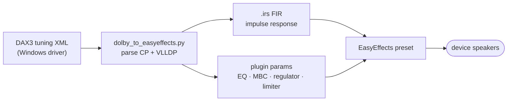

# Dolby Atmos Speaker Tuning to EasyEffects Presets for Linux

Bring your laptop's Windows speaker tuning to Linux. This script converts the
Dolby Atmos DAX3 tuning XML shipped inside Windows audio drivers into
[EasyEffects](https://github.com/wwmm/easyeffects) 8.x output presets. Your
speakers get the same speaker correction, EQ, and dynamics processing as on
Windows, at zero added latency.

Confirmed on over 40 laptops from ASUS, Framework and Lenovo: see
[Supported devices](#supported-devices). Tested yours?
[Report it](https://github.com/antoinecellerier/speaker-tuning-to-easyeffects/issues/new?template=device-report.yml),
whether it works or not.

Don't want to run EasyEffects? The same tuning also runs as a self-contained
PipeWire filter-chain, with no GUI and no extra daemon. See
[PipeWire filter-chain](docs/dolby-to-pipewire.md).

**Contents:** [Quick start](#quick-start) · [Install](#install) ·
[Something not right?](#something-not-right) ·
[Documentation](#documentation) ·
[Staying up to date](#staying-up-to-date) ·
[Supported devices](#supported-devices) · [How it works](#how-it-works)

## Quick start

> **EasyEffects 8.x required.** If your distro ships EasyEffects 7, install the
> [Flatpak](https://flathub.org/apps/com.github.wwmm.easyeffects). The EE 7 and
> EE 8 preset formats aren't compatible. Debian trixie, Ubuntu 25.10 and
> Fedora 43, and earlier releases of each, ship EE 7 or older. Or skip EasyEffects: the
> [PipeWire filter-chain](docs/dolby-to-pipewire.md) runs the same tuning
> without it.

1. Download the code. Take the *Source code (zip)* from the
   [latest release](https://github.com/antoinecellerier/speaker-tuning-to-easyeffects/releases/latest),
   unzip it, and open a terminal in the unzipped folder.

   If you use git, clone the repository instead:

   ```bash
   git clone https://github.com/antoinecellerier/speaker-tuning-to-easyeffects.git
   cd speaker-tuning-to-easyeffects
   ```

2. Install EasyEffects 8.x. Prefer your distribution's `easyeffects` package
   when it ships version 8, since it then updates with the rest of your
   system. If it ships an older version, use the Flatpak instead:

   ```bash
   flatpak install flathub com.github.wwmm.easyeffects
   ```

   Then install the dependencies listed under [Install](#install). In short:
   Python 3 with NumPy and SciPy.

3. Run the script.

   No Windows partition? [Get the tuning XML](docs/getting-the-xml.md)
   first.

   The script needs no path if your Windows partition is mounted or a driver
   package is extracted in the current directory:

   ```bash
   python3 dolby_to_easyeffects.py --autoload
   ```

   Or point it at the Windows directory, extracted driver package or a tuning
   XML:

   ```bash
   python3 dolby_to_easyeffects.py --windows /mnt/windows/Windows --autoload
   python3 dolby_to_easyeffects.py path/to/DEV_0287_SUBSYS_*.xml --autoload
   ```

`--autoload` sets EasyEffects to apply the Dolby correction on your internal
speaker automatically. Skip it if you'd rather select Dolby-Balanced,
Dolby-Detailed or Dolby-Warm yourself under Presets. See
[Autoload](docs/dolby-to-easyeffects.md#autoload) for details.

To keep the correction after you close EasyEffects or reboot, enable
Background Service and Autostart on login in EasyEffects' preferences.

**Safe to try.** The three scripts need no root: they refuse to run under
`sudo`. By default they keep what they write under your home directory, apart
from temporary files they delete.
[Undo](docs/dolby-to-easyeffects.md#undo) lists what a run writes and how to
remove it. On the filter-chain, see
[PipeWire filter-chain](docs/dolby-to-pipewire.md), under "To remove the
filter".


## Install

The script needs Python 3, [NumPy](https://numpy.org/), and
[SciPy](https://scipy.org/).

PipeWire's `pw-dump` is also required by the script's `--autoload`. The PipeWire
scripts need it whenever they auto-detect your speaker sink, which is every run
without `--target-sink`. It ships in the same package as the daemon on Debian,
Ubuntu and Arch. Fedora, openSUSE and Alpine split the command-line tools into
their own package. If it's missing, the scripts name its package for your
distribution.

[Rich](https://github.com/Textualize/rich) and
[rich-argparse](https://github.com/hamdanal/rich-argparse) are optional. With
them, the script renders its output and `--help` with semantic colors. Without
them, everything works in plain monochrome.
[argcomplete](https://github.com/kislyuk/argcomplete) is optional too, for
[shell tab-completion](docs/shell-completion.md).

Install commands for your distro:

- **Debian/Ubuntu/Mint/Pop!_OS:**
  `sudo apt install python3-numpy python3-scipy python3-rich python3-rich-argparse`
- **Fedora/RHEL/Rocky/Alma:**
  `sudo dnf install python3-numpy python3-scipy python3-rich python3-rich-argparse`
- **openSUSE:**
  `sudo zypper install python3-numpy python3-scipy python3-rich python3-rich-argparse`
- **Arch/Manjaro/EndeavourOS:**
  `sudo pacman -S python-numpy python-scipy python-rich python-rich-argparse`
- **Alpine:** `sudo apk add py3-numpy py3-scipy py3-rich` — Alpine has no
  rich-argparse package, so `--help` stays plain there
- **Gentoo:**
  `sudo emerge dev-python/numpy dev-python/scipy dev-python/rich dev-python/rich-argparse`
- **NixOS:**
  `nix-shell -p "python3.withPackages (ps: with ps; [ numpy scipy rich rich-argparse ])"`

If your distro isn't listed or you'd rather not touch system
packages, a Python virtual environment works too:

```bash
python3 -m venv .venv && source .venv/bin/activate
pip install -r requirements.txt
```

<a id="troubleshooting-a-preset-that-sounds-like-nothing"></a>
<a id="troubleshooting-correct-but-too-quiet"></a>
<a id="disabling-and-enabling-filters"></a>

## Something not right?

Start with `--doctor`: run `python3 dolby_to_easyeffects.py --doctor`, or
`python3 dolby_to_pipewire.py --doctor` if you use the PipeWire filter-chain.
Each reports what it finds and what to do about it.

- **No audible difference.**
  [Check the EasyEffects setup](docs/troubleshooting.md#troubleshooting-a-preset-that-sounds-like-nothing)
  before suspecting the preset.
- **Right, but quieter than Windows.**
  [Try the loudness options](docs/troubleshooting.md#troubleshooting-correct-but-too-quiet),
  such as `--enable autogain`.
- **Loud parts crushed, pumping or harsh highs.**
  [Rebuild the preset without the filter responsible](docs/filters.md).
- **"No matching DAX3 tuning XML found".**
  [Get the tuning XML](docs/getting-the-xml.md) another way.
- **The effect stops after you close EasyEffects or reboot.**
  [Enable its Background Service](docs/troubleshooting.md#troubleshooting-a-preset-that-sounds-like-nothing).
- **The Dolby tuning plays on HDMI, Bluetooth or a headset.**
  [Let autoload bypass other outputs](docs/dolby-to-easyeffects.md#how-speaker-detection-and-the-bypass-fallback-work).
  It needs `--autoload`.
- **Re-ran the script but hear no change.** Pick the preset again in
  EasyEffects' Presets menu. Only releases whose changelog entry is tagged
  **[AUDIBLE]** change the sound: [Staying up to date](#staying-up-to-date).

The [troubleshooting guide](docs/troubleshooting.md) covers more symptoms.

<a id="usage"></a>
<a id="command-line-options"></a>
<a id="advanced"></a>
<a id="autoload"></a>
<a id="pipewire-filter-chain-instead-of-easyeffects"></a>
<a id="quick-start-pipewire"></a>
<a id="which-should-i-use"></a>
<a id="extracting-the-xml"></a>
<a id="auto-detection-notes"></a>
<a id="shell-tab-completion"></a>
<a id="running-the-tests"></a>
<a id="further-reading"></a>

## Documentation

- [Extracting the XML](docs/getting-the-xml.md) — when you have no Windows
  partition, or the script can't find your tuning
- [EasyEffects presets](docs/dolby-to-easyeffects.md) — every
  `dolby_to_easyeffects.py` option, autoload, and how to undo a run
- [PipeWire filter-chain](docs/dolby-to-pipewire.md) — the same tuning without
  EasyEffects, through `dolby_to_pipewire.py`
- [Disabling and enabling filters](docs/filters.md) — to remove an artifact, or
  try an optional stage
- [Troubleshooting](docs/troubleshooting.md) — no difference, too quiet, and
  other symptoms
- [Shell tab-completion](docs/shell-completion.md) — flag and value completion
  for all three scripts

The [docs index](docs/README.md) also lists the technical reference, the
research log and how to run the tests.

## Staying up to date

[CHANGELOG.md](CHANGELOG.md) tracks notable changes. To be notified when a new
version ships, click **Watch → Custom → Releases** at the top of the GitHub
page.

Entries tagged **[AUDIBLE]** change the *sound* of the generated preset. When
you see one, get the
[latest release](https://github.com/antoinecellerier/speaker-tuning-to-easyeffects/releases/latest)
or `git pull`, and **re-run the script** to regenerate and reload your preset,
or the `dolby_to_pipewire.py` wrapper if you use it. The run loads it into a
running EasyEffects when it can, and says what to pick otherwise. Other entries
are tooling,
packaging, docs, or new-device support that doesn't alter existing devices'
output, so there's nothing to regenerate.

## Supported devices

The converter works on the internal speakers of laptops, handhelds and other
devices whose Windows driver ships a Dolby DAX3 tuning. Confirmed on:

| Device | Reported by |
|---|---|
| ASUS TUF Gaming A15 (FA507NV) <!-- Realtek ALC256, 1043:19DD --> | [#34](https://github.com/antoinecellerier/speaker-tuning-to-easyeffects/issues/34) |
| ASUS Zenbook 14 UX3405CA, UX3405MA <!-- Realtek ALC294, 1043:1A63 --> | [#19](https://github.com/antoinecellerier/speaker-tuning-to-easyeffects/issues/19), [#24](https://github.com/antoinecellerier/speaker-tuning-to-easyeffects/issues/24) |
| Framework Laptop 13 Pro (Intel Core Ultra Series 3) <!-- Realtek ALC285, F111:000F --> | [#73](https://github.com/antoinecellerier/speaker-tuning-to-easyeffects/issues/73) |
| Lenovo IdeaPad 3 15ALC6 (82KU) <!-- Realtek ALC257, 17AA:38BC --> | [#103](https://github.com/antoinecellerier/speaker-tuning-to-easyeffects/issues/103) |
| Lenovo IdeaPad Pro 5 14AHP9 (83D3) <!-- Realtek ALC287, 17AA:38D0 --> | [#18](https://github.com/antoinecellerier/speaker-tuning-to-easyeffects/issues/18) |
| Lenovo IdeaPad Pro 5 14APH8 (83AM) <!-- Realtek ALC287, 17AA:38C5 --> | [#33](https://github.com/antoinecellerier/speaker-tuning-to-easyeffects/issues/33) — reporter confirms working on kernel 7.0, broken on 6.12 |
| Lenovo IdeaPad Pro 5 14IMH9 (83D2) <!-- Realtek ALC287, 17AA:38CE --> | [#36](https://github.com/antoinecellerier/speaker-tuning-to-easyeffects/issues/36) — reporter recommends enabling autogain |
| Lenovo Legion Y540-15IRH (81SX) <!-- Realtek ALC257, 17AA:380F --> | [#70](https://github.com/antoinecellerier/speaker-tuning-to-easyeffects/issues/70) |
| Lenovo Legion Y7000 2020 (82AV) <!-- Realtek ALC257, 17AA:3872 --> | [#93](https://github.com/antoinecellerier/speaker-tuning-to-easyeffects/issues/93) |
| Lenovo ThinkBook 16p G5 IRX (21N5) <!-- Realtek ALC287, 17AA:38F9 --> | [#76](https://github.com/antoinecellerier/speaker-tuning-to-easyeffects/issues/76) |
| Lenovo XiaoXinPro-13ARE 2020 (82DM) <!-- Realtek ALC257, 17AA:387F --> | [#91](https://github.com/antoinecellerier/speaker-tuning-to-easyeffects/issues/91) |
| Lenovo Yoga 7 2-in-1 16AKP10 <!-- — --> | [#1](https://github.com/antoinecellerier/speaker-tuning-to-easyeffects/issues/1) |
| Lenovo Yoga 7 16IAH7 (82UF) <!-- Realtek ALC287, 17AA:386A --> | [#53](https://github.com/antoinecellerier/speaker-tuning-to-easyeffects/issues/53) — woofers need kernel 7.2, or the `hda_model=` line the tool prints |
| Lenovo Yoga Pro 7 14APH8 (82Y8) <!-- Realtek ALC287, 17AA:38C6 --> | [#30](https://github.com/antoinecellerier/speaker-tuning-to-easyeffects/issues/30) |
| Lenovo Yoga Pro 7 14ASP9 (83HN) <!-- Realtek ALC287, 17AA:38A7 --> | [#51](https://github.com/antoinecellerier/speaker-tuning-to-easyeffects/issues/51) |
| Lenovo Yoga Pro 7 14IMH9 (83E2) <!-- Realtek ALC287, 17AA:38CF --> | [#83](https://github.com/antoinecellerier/speaker-tuning-to-easyeffects/issues/83) |
| Lenovo Yoga Pro 9i 14IRP8 (83BU) <!-- Realtek ALC287, 17AA:38BE --> | [#17](https://github.com/antoinecellerier/speaker-tuning-to-easyeffects/issues/17) |
| Lenovo Yoga Slim 7 14ARE05 (82A2) <!-- Realtek ALC287, 17AA:380D --> | [#44](https://github.com/antoinecellerier/speaker-tuning-to-easyeffects/issues/44) — reporter finds it on par with Windows with `--volmax-slot output-gain`, which brings back bass the default placement loses |
| Lenovo Yoga Slim 7 14ILL10 (83JX) <!-- Soundwire 17AA:3838 --> | [#59](https://github.com/antoinecellerier/speaker-tuning-to-easyeffects/issues/59) |
| Lenovo Yoga Slim 7 Pro 14ACH5 (82MS, reported as Yoga 14sACH 2021) <!-- Realtek ALC287, 17AA:384F --> | [#84](https://github.com/antoinecellerier/speaker-tuning-to-easyeffects/issues/84) |
| ThinkPad E14 Gen 2 AMD (20T6) <!-- Realtek ALC257, 17AA:507F --> | [#25](https://github.com/antoinecellerier/speaker-tuning-to-easyeffects/issues/25) — verified close-to-Windows: needs `--enable autogain`, plus to taste a raised Autogain *Target* (EE GUI) and desktop volume >100% |
| ThinkPad L14 Gen 6 AMD (21S8) <!-- Realtek ALC257, 17AA:50FF --> | [#61](https://github.com/antoinecellerier/speaker-tuning-to-easyeffects/issues/61) |
| ThinkPad T14 Gen 1 (20S1) <!-- Realtek ALC257, 17AA:22B1 --> | [#86](https://github.com/antoinecellerier/speaker-tuning-to-easyeffects/issues/86) |
| ThinkPad T14 Gen 1 AMD (20UD, 20UE) <!-- Realtek ALC257, 17AA:5081 --> | [#45](https://github.com/antoinecellerier/speaker-tuning-to-easyeffects/issues/45) |
| ThinkPad T14 Gen 2 AMD (20XL) <!-- Realtek ALC257, 17AA:5094 --> | [#80](https://github.com/antoinecellerier/speaker-tuning-to-easyeffects/issues/80) |
| ThinkPad T14 Gen 2 Intel (20W1) <!-- Realtek ALC257, 17AA:22C9 --> | [#55](https://github.com/antoinecellerier/speaker-tuning-to-easyeffects/issues/55) |
| ThinkPad T14 Gen 7 AMD (21WV, 21WW) <!-- Realtek ALC257, 17AA:5144 --> | [#48](https://github.com/antoinecellerier/speaker-tuning-to-easyeffects/issues/48) |
| ThinkPad T14 Gen 7 Intel (21WN) <!-- Realtek ALC257, 17AA:2356 --> | [#42](https://github.com/antoinecellerier/speaker-tuning-to-easyeffects/issues/42) |
| ThinkPad T14s Gen 2 AMD (20XG) <!-- Realtek ALC257, 17AA:5096 --> | [#57](https://github.com/antoinecellerier/speaker-tuning-to-easyeffects/issues/57) |
| ThinkPad T14s Gen 3 (21BS) <!-- Realtek ALC257, 17AA:22EE --> | [#88](https://github.com/antoinecellerier/speaker-tuning-to-easyeffects/issues/88) |
| ThinkPad T14s Gen 6 AMD <!-- 17AA:50F0 --> | [#3](https://github.com/antoinecellerier/speaker-tuning-to-easyeffects/issues/3) |
| ThinkPad X1 Carbon Gen 9 (20XW) <!-- Realtek ALC287, 17AA:22D5 --> | [#63](https://github.com/antoinecellerier/speaker-tuning-to-easyeffects/issues/63) |
| ThinkPad X1 Carbon Gen 10 (21CC) <!-- Realtek ALC287, 17AA:22E7 --> | [#99](https://github.com/antoinecellerier/speaker-tuning-to-easyeffects/issues/99) |
| ThinkPad X1 Carbon Gen 11 (21HN) <!-- Realtek ALC287, 17AA:2315 --> | [#95](https://github.com/antoinecellerier/speaker-tuning-to-easyeffects/issues/95) |
| ThinkPad X1 Carbon Gen 13 <!-- Soundwire 17AA:2339 --> | [#7](https://github.com/antoinecellerier/speaker-tuning-to-easyeffects/pull/7/) |
| ThinkPad X1 Yoga Gen 6 (20Y0) <!-- Realtek ALC287, 17AA:22D4 --> | [#78](https://github.com/antoinecellerier/speaker-tuning-to-easyeffects/issues/78) |
| ThinkPad X1 Yoga Gen 7 (21CD) <!-- Realtek ALC287, 17AA:22E6 --> | author |
| ThinkPad X13 Gen 2 Intel (20WK) <!-- Realtek ALC257, 17AA:22CF --> | [#105](https://github.com/antoinecellerier/speaker-tuning-to-easyeffects/issues/105) |
| ThinkPad X13 Gen 6 Intel (21RK) <!-- Realtek ALC257, 17AA:2344 --> | [#23](https://github.com/antoinecellerier/speaker-tuning-to-easyeffects/issues/23) |
| ThinkPad X13 Yoga Gen 2 (20W9) <!-- Realtek ALC285, 17AA:22D6 --> | [#101](https://github.com/antoinecellerier/speaker-tuning-to-easyeffects/issues/101) |
| ThinkPad X13 Yoga Gen 4 (21F3) <!-- Realtek ALC257, 17AA:230D --> | [#97](https://github.com/antoinecellerier/speaker-tuning-to-easyeffects/issues/97) |

If you test it on other hardware, please
[open a device report](https://github.com/antoinecellerier/speaker-tuning-to-easyeffects/issues/new?template=device-report.yml)
whether it works or not.
## How it works

The script parses the DAX3 XML's two processing stages. It emits a minimum-phase
FIR impulse response plus a chain of EasyEffects plugins, at zero added latency.
Every parameter traces back to an XML field.



The preset is up to eight plugins, in this order:

1. Convolver: FIR speaker correction
2. Bass Enhancer: SoundWire only
3. Equalizer: speaker PEQ
4. Dialog Enhancer
5. Autogain: bypassed by default on HDA
6. Multiband Compressor
7. Regulator: per-band limiter
8. Limiter: brickwall safety net


For the full detail, see the [docs index](docs/README.md).

## References

- [wwmm/easyeffects](https://github.com/wwmm/easyeffects) — preset format
  reference
- [shuhaowu/linux-thinkpad-speaker-improvements](https://github.com/shuhaowu/linux-thinkpad-speaker-improvements)
  — alternative approach using captured impulse responses via WASAPI loopback
- [taprobane99/Lenovo-Yoga-Slim-7x-Dolby-Linux-Audio](https://github.com/taprobane99/Lenovo-Yoga-Slim-7x-Dolby-Linux-Audio)
  — downstream port of this script's output to a PipeWire filter-chain config
  with 4-speaker upmix on Snapdragon X. See
  [docs/alternative-pipelines.md](docs/alternative-pipelines.md) Option 3.
- [sklynic/easyeffects-tuf-gaming-a15](https://github.com/sklynic/easyeffects-tuf-gaming-a15)
  — manual DAX3 EQ extraction for ASUS laptops
- [mister2d/thinkpad-linux-audio](https://github.com/mister2d/thinkpad-linux-audio/)
  — extended Dolby pipeline for ThinkPads, built on top of this tooling. See
  [#2](https://github.com/antoinecellerier/speaker-tuning-to-easyeffects/issues/2).
